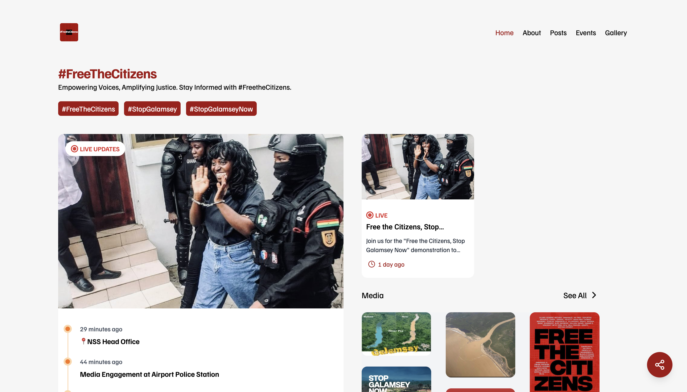

# #FreeTheCitizens - Stop Galamsey Awareness Application



This project is a Next.js web application created to raise awareness about the negative impact of illegal mining ("galamsey") on water bodies in Ghana. The platform empowers users by sharing live updates, posts, media, and event information about the ongoing efforts to stop galamsey and its environmental damage. It includes social media integration, live updates, and a gallery of images related to the cause.

## Table of Contents

- [Highlights](#highlights)
- [Technologies](#technologies)
- [Installation](#installation)
- [Usage](#usage)
- [Steps to Reproduce](#steps-to-reproduce)
- [License](#license)

## Highlights

- **Live Updates**: Display live events and news related to anti-galamsey efforts.
- **Social Sharing**: Integrated buttons for sharing updates on Twitter, WhatsApp, and Facebook.
- **Media Gallery**: Browse through photos showing the impact of galamsey on water bodies.
- **Real-time Posts**: Users can view the latest news and posts on galamsey protests and related activities.

## Technologies

- **Next.js**: React framework used for both frontend and backend.
- **Tanstack Query**: For data fetching
- **Framer Motion**: Animation library for smooth transitions.
- **Tailwind CSS**: Utility-first CSS framework used for styling.

## Installation

Follow these steps to set up and run the application on your local machine.

### Prerequisites

- Node.js
- npm or yarn

### Clone the Repository

```bash
git clone https://github.com/ftc-org/ftc-web
cd ftc-web
```

### Install Dependencies

```bash
yarn install
```

### Run Dev server

```bash
yarn dev
```

## Contributors

We would like to acknowledge the following contributors who helped build this project:

- **[Yeboah Nana Osei](https://github.com/yeboahnanaosei)**
- **[Kwame Junior](https://github.com/quamejnr)**
- **[Topboy Asante ](https://github.com/topboyasante)**
- **[Saviour Gidi ](https://github.com/saviour123)**
- **[Albert Dugba ](https://github.com/albertdugba)**
- **[Bright Kwaku ](https://github.com/kwekujasper)**
- **[Cryptic Warden ](https://github.com/crypticwarden)**
- **Contributor Name** - Role or Contribution
- **Contributor Name** - Role or Contribution

If you would like to contribute, feel free to fork the repository and submit a pull request.
